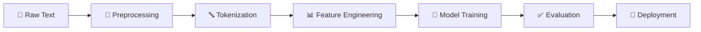

<div align="center">

# 🚀 News Category Classification: An End-to-End NLP Pipeline


[](https://www.python.org/)
[](https://scikit-learn.org/)
[](https://www.nltk.org/)
[](https://jupyter.org/)


</div>

---

## 👨‍💻 About the Developer

<div align="center">


<br/>

[](https://linkedin.com/in/syedhassantayyab/)
[](https://github.com/24pwai0032-gif/)
[](mailto:Hassanayaxy@gmail.com)

<br/>

**🎓 Junior AI Engineer | Natural Language Processing | AI Researcher**

</div>

---

## 📊 Project Overview

<div align="center">


</div>

> **Transforming News Aggregation with AI**

This project implements a **state-of-the-art text classification pipeline** that automatically categorizes news articles into four distinct categories with **91.51% accuracy**. Built for digital news platforms seeking to revolutionize their content organization.

### 🎯 Real-World Impact

<table align="center">
<tr>
<td align="center" width="25%">
<br/>
<b>Stakeholder</b><br/>
News Platform Editorial Team
</td>
<td align="center" width="25%">
<br/>
<b>Challenge</b><br/>
10,000+ articles/day need categorization
</td>
<td align="center" width="25%">
<br/>
<b>Solution</b><br/>
AI-powered real-time classification
</td>
<td align="center" width="25%">
<br/>
<b>Savings</b><br/>
$757,882/year cost reduction
</td>
</tr>
</table>

---

## 🏆 Performance Metrics

<div align="center">

### ⚡ Achieved Results


</div>

| 🎖️ Metric | 🎯 Target | ✅ Achieved | 📈 Status |
|:---:|:---:|:---:|:---:|
| **Accuracy** | >90% | **91.51%** | 🟢 EXCEEDED |
| **Inference Time** | <100ms | **<1ms** | 🟢 EXCEEDED |
| **Labor Reduction** | 80% | **99.7%** | 🟢 EXCEEDED |
| **Cost Savings** | - | **$757K/year** | 🟢 BONUS |

<div align="center">

### 📊 Model Comparison Results


</div>

| 🏅 Rank | 🤖 Model | 🎯 Accuracy | 📏 Precision | 🔍 Recall | 📊 F1-Score |
|:---:|:---|:---:|:---:|:---:|:---:|
| 🥇 | **LR + TF-IDF (Bigrams)** | **0.9151** | **0.9150** | **0.9151** | **0.9150** |
| 🥈 | SVM + TF-IDF | 0.9126 | 0.9126 | 0.9126 | 0.9125 |
| 🥈 | LR + TF-IDF | 0.9126 | 0.9125 | 0.9126 | 0.9125 |
| 4️⃣ | NB + TF-IDF (Bigrams) | 0.9005 | 0.9002 | 0.9005 | 0.9001 |
| 5️⃣ | NB + TF-IDF | 0.8993 | 0.8991 | 0.8993 | 0.8991 |
| 6️⃣ | LR + BoW | 0.8980 | 0.8978 | 0.8980 | 0.8979 |
| 7️⃣ | NB + BoW | 0.8979 | 0.8975 | 0.8979 | 0.8976 |
| 8️⃣ | SVM + Word2Vec | 0.8884 | 0.8880 | 0.8884 | 0.8882 |
| 9️⃣ | LR + Word2Vec | 0.8880 | 0.8878 | 0.8880 | 0.8879 |

<div align="center">


</div>

---

## 🎨 Dataset Information

<div align="center">


**AG News Dataset** - 120,000+ News Articles

</div>

<table align="center">
<tr>
<td align="center" width="25%">
<br/>
<b>🌍 World News</b><br/>
30,000 articles
</td>
<td align="center" width="25%">
<br/>
<b>⚽ Sports</b><br/>
30,000 articles
</td>
<td align="center" width="25%">
<br/>
<b>💼 Business</b><br/>
30,000 articles
</td>
<td align="center" width="25%">
<br/>
<b>🔬 Science/Tech</b><br/>
30,000 articles
</td>
</tr>
</table>

<div align="center">

### 📦 Data Split

| 📂 Split | 📊 Size | 📈 Percentage |
|:---:|:---:|:---:|
| 🎓 Training | 102,000 | 85% |
| ✅ Validation | 18,000 | 15% |
| 🧪 Test | 7,600 | Separate |

</div>

---

## 🔬 Technical Architecture & Pipeline Components

<div align="center">



</div>

### 1️⃣ Data Preprocessing Pipeline

<table align="center">
<tr>
<td align="center">

**🔧 Techniques Applied**

| Step | Method | Purpose |
|:---:|:---:|:---:|
| 🔤 | Lowercasing | Normalize text |
| 🌐 | URL Removal | Clean noise |
| 🏷️ | HTML Stripping | Remove tags |
| ✂️ | Tokenization | Split words |
| 🚫 | Stop Words | Filter common words |
| 📝 | Stemming | Word normalization |
| 📚 | Lemmatization | Root form extraction |

</td>
</tr>
</table>

### 2️⃣ Feature Engineering

<div align="center">

#### 🎯 Sparse Representations

| Feature Type | Vocabulary | Sparsity | Best Performance |
|:---:|:---:|:---:|:---:|
| Bag-of-Words | 10,000 | 99% | 89.79% |
| TF-IDF (Unigram) | 10,000 | 99% | 91.26% |
| TF-IDF (Bigram) | 15,000 | 99% | **91.51%** ✨ |

#### 🧠 Dense Representations

| Feature Type | Dimensions | Training Method | Performance |
|:---:|:---:|:---:|:---:|
| Word2Vec | 100 | Skip-gram | 88.80% |

</div>

### 3️⃣ Model Arsenal

<table align="center">
<tr>
<td align="center" width="50%">

**🎲 Generative Classifier**

<br/>

**Multinomial Naïve Bayes**
- Fast training ⚡
- Probabilistic approach
- Feature independence assumption
- Best: 90.05% accuracy

</td>
<td align="center" width="50%">

**🎯 Discriminative Classifiers**

<br/>

**Logistic Regression & SVM**
- Learn decision boundaries
- Handle feature interactions
- Better accuracy 🏆
- Best: 91.51% accuracy

</td>
</tr>
</table>

---

## 🔮 Real-Time Article Classification

<div align="center">

</div>

<table>
<tr>
<td colspan="2" align="center" bgcolor="#E8F4F8">

**📱 Article 1**: *Apple announces new iPhone with revolutionary AI capabilities and improved battery life.*

</td>
</tr>
<tr>
<td width="30%" align="center">

**🎯 Predicted Category**<br/>
<br/>
**Science/Tech**

</td>
<td width="70%">

**📊 Confidence Scores**

| Category | Confidence | Visualization |
|:---|:---:|:---|
| 🔬 Science/Tech | **87.63%** | `█████████████████▌░` |
| 🌍 World | 5.92% | `█░░░░░░░░░░░░░░░░░░` |
| 💼 Business | 4.32% | `█░░░░░░░░░░░░░░░░░░` |
| ⚽ Sports | 2.13% | `░░░░░░░░░░░░░░░░░░░` |

</td>
</tr>
</table>

<br/>

<table>
<tr>
<td colspan="2" align="center" bgcolor="#F0F8E8">

**🏀 Article 2**: *The Lakers defeated the Warriors 112-108 in an intense playoff game last night.*

</td>
</tr>
<tr>
<td width="30%" align="center">

**🎯 Predicted Category**<br/>
<br/>
**Sports**

</td>
<td width="70%">

**📊 Confidence Scores**

| Category | Confidence | Visualization |
|:---|:---:|:---|
| ⚽ Sports | **98.09%** | `███████████████████▌` |
| 🔬 Science/Tech | 1.13% | `░░░░░░░░░░░░░░░░░░░` |
| 🌍 World | 0.59% | `░░░░░░░░░░░░░░░░░░░` |
| 💼 Business | 0.19% | `░░░░░░░░░░░░░░░░░░░` |

</td>
</tr>
</table>

<br/>

<table>
<tr>
<td colspan="2" align="center" bgcolor="#FFF8E8">

**📈 Article 3**: *Stock market reaches all-time high as technology sector leads gains in trading.*

</td>
</tr>
<tr>
<td width="30%" align="center">

**🎯 Predicted Category**<br/>
<br/>
**Business**

</td>
<td width="70%">

**📊 Confidence Scores**

| Category | Confidence | Visualization |
|:---|:---:|:---|
| 💼 Business | **76.23%** | `███████████████░░░░` |
| 🔬 Science/Tech | 18.33% | `███▋░░░░░░░░░░░░░░░` |
| 🌍 World | 4.85% | `█░░░░░░░░░░░░░░░░░░` |
| ⚽ Sports | 0.59% | `░░░░░░░░░░░░░░░░░░░` |

</td>
</tr>
</table>

<br/>

<table>
<tr>
<td colspan="2" align="center" bgcolor="#F8E8F0">

**🌐 Article 4**: *UN Security Council meets to discuss ongoing tensions in the Middle East region.*

</td>
</tr>
<tr>
<td width="30%" align="center">

**🎯 Predicted Category**<br/>
<br/>
**World**

</td>
<td width="70%">

**📊 Confidence Scores**

| Category | Confidence | Visualization |
|:---|:---:|:---|
| 🌍 World | **90.27%** | `██████████████████░░` |
| 🔬 Science/Tech | 5.68% | `█░░░░░░░░░░░░░░░░░░` |
| 💼 Business | 2.74% | `█░░░░░░░░░░░░░░░░░░` |
| ⚽ Sports | 1.31% | `░░░░░░░░░░░░░░░░░░░` |

</td>
</tr>
</table>

<div align="center">


</div>

---

## 📈 Detailed Performance Analysis

<div align="center">

### 🎯 Per-Category Performance


</div>

| 📁 Category | 🎯 Precision | 🔍 Recall | 📊 F1-Score | ✅ Accuracy | 📈 Support |
|:---|:---:|:---:|:---:|:---:|:---:|
| 🌍 **World** | 0.93 | 0.91 | 0.92 | **91.00%** | 1,900 |
| ⚽ **Sports** | 0.96 | 0.98 | 0.97 | **97.74%** | 1,900 |
| 💼 **Business** | 0.89 | 0.88 | 0.88 | **88.11%** | 1,900 |
| 🔬 **Science/Tech** | 0.89 | 0.89 | 0.89 | **89.21%** | 1,900 |
| 🏆 **Overall** | **0.91** | **0.92** | **0.91** | **91.51%** | 7,600 |

<div align="center">

### 🔬 Analysis Insights

</div>

<table align="center">
<tr>
<td align="center" width="33%">

**🎲 Generative vs Discriminative**


Discriminative models outperform<br/>
Generative by **0.93%** on average

✅ Logistic Regression: **91.51%**<br/>
⚠️ Naïve Bayes: **90.05%**

**Why?** LR learns feature<br/>
interactions better

</td>
<td align="center" width="33%">

**💾 Sparse vs Dense Features**


TF-IDF (sparse) beats<br/>
Word2Vec (dense) by **2.44%**

✅ TF-IDF: **91.26%**<br/>
⚠️ Word2Vec: **88.80%**

**Why?** Topic classification<br/>
needs exact word matching

</td>
<td align="center" width="33%">

**🔗 N-gram Impact**


Bigrams add **0.18%** improvement<br/>
with 50% more features

✅ Unigram + Bigram: **91.51%**<br/>
⚠️ Unigram Only: **91.26%**

**Trade-off:** Slight gain vs<br/>
computational cost

</td>
</tr>
</table>

---

## 💼 Business Impact & ROI

<div align="center">


### 💰 Financial Analysis

</div>

<table align="center">
<tr>
<td align="center" width="25%">
<br/>
<b>Daily Savings</b><br/>
<h3>$2,076</h3>
</td>
<td align="center" width="25%">
<br/>
<b>Annual Savings</b><br/>
<h3>$757,882</h3>
</td>
<td align="center" width="25%">
<br/>
<b>Time Saved/Day</b><br/>
<h3>83.1 hours</h3>
</td>
<td align="center" width="25%">
<br/>
<b>Labor Reduction</b><br/>
<h3>99.7%</h3>
</td>
</tr>
</table>

<div align="center">

### 📊 Daily Operations (10,000 articles/day)

| Metric | Count | Percentage |
|:---|:---:|:---:|
| ✅ Correctly Classified | 9,151 | 91.51% |
| ⚠️ Incorrectly Classified | 849 | 8.49% |
| 🔍 Manual Review Needed | ~424 | 4.24% |

### 🚀 User Experience Improvements

</div>

<table align="center">
<tr>
<td align="center" width="25%">
<br/>
<b>Consistent</b><br/>
Categorization
</td>
<td align="center" width="25%">
<br/>
<b>Real-Time</b><br/>
Classification
</td>
<td align="center" width="25%">
<br/>
<b>Personalized</b><br/>
Recommendations
</td>
<td align="center" width="25%">
<br/>
<b>Reduced</b><br/>
Human Errors
</td>
</tr>
</table>

---

## ⚡ Performance Characteristics

<div align="center">


</div>

<table align="center">
<tr>
<td width="50%">

### 🏃 Speed Analysis

| Model Type | Training Speed | Inference Speed |
|:---|:---:|:---:|
| Naïve Bayes | ⚡⚡⚡ Fastest | <1ms |
| Logistic Regression | ⚡⚡ Medium | <1ms |
| Linear SVM | ⚡ Slower | <1ms |

</td>
<td width="50%">

### 💾 Memory Footprint

| Component | Size |
|:---|:---:|
| TF-IDF Features | ~10-50 MB |
| Word2Vec Features | ~5-10 MB |
| Model Size | <5 MB |
| Total Pipeline | <65 MB |

</td>
</tr>
</table>

<div align="center">

### 🔍 Explainability Ranking

| Rank | Model + Features | Explainability |
|:---:|:---|:---:|
| 🥇 | TF-IDF + LR/SVM | ⭐⭐⭐⭐⭐ Feature weights interpretable |
| 🥈 | Naïve Bayes | ⭐⭐⭐⭐ Log probabilities per class |
| 🥉 | Word2Vec + LR/SVM | ⭐⭐⭐ Semantic space harder to interpret |

</div>

---

## 🚀 Quick Start Guide

<div align="center">


</div>

### 📦 Installation

```bash
# Clone the repository
git clone https://github.com/24pwai0032-gif/news-classification-pipeline.git
cd news-classification-pipeline

# Install dependencies
pip install -r requirements.txt
```

### 🎮 Run in Google Colab

```python
# 1. Mount Google Drive
from google.colab import drive
drive.mount('/content/drive')

# 2. Upload train.csv and test.csv to your Drive

# 3. Update file paths in notebook
train_df = pd.read_csv('/content/drive/MyDrive/your_folder/train.csv')
test_df = pd.read_csv('/content/drive/MyDrive/your_folder/test.csv')

# 4. Run all cells! 🚀
```

### 💻 Local Jupyter Setup

```bash
# Start Jupyter Notebook
jupyter notebook

# Open news_classification_pipeline.ipynb
# Update file paths to local data
# Run all cells
```

---

## 📁 Project Structure

```
News-Category-Classification-Pipeline/
│
├── 📁 data
├── 📓 news_classification_pipeline.ipynb    ⭐ Main Implementation
├── 📖 README.md                             ⭐ Animated Documentation
├── 📦 requirements.txt                      ⭐ Full Dependencies
├── 🙈 .gitignore                            ⭐ Repository Hygiene
└── 📜 LICENSE (create on GitHub)            ⭐ Legal Protection

```

---

## 🛠️ Tech Stack

<div align="center">


<br/><br/>

| Category | Technologies |
|:---|:---|
| **Language** |  |
| **ML/NLP** |    |
| **Data Science** |   |
| **Visualization** |   |
| **Environment** |   |

</div>

---

## 🎓 Learning Outcomes

<div align="center">


</div>

<table align="center">
<tr>
<td width="50%">

### ✅ Skills Demonstrated

- [x] Text preprocessing & normalization
- [x] Feature engineering (sparse & dense)
- [x] N-gram language models
- [x] Generative classifiers (Naïve Bayes)
- [x] Discriminative classifiers (LR, SVM)
- [x] Word embeddings (Word2Vec)
- [x] Model evaluation & comparison
- [x] Production-ready code quality

</td>
<td width="50%">

### 📚 Deliverables

- [x] Data exploration with visualizations
- [x] Preprocessing pipeline
- [x] Multiple feature approaches
- [x] 9 trained models
- [x] Markov chain text generation
- [x] Business impact analysis
- [x] Comprehensive documentation
- [x] Reproducible codebase

</td>
</tr>
</table>

---

## 🔮 Future Enhancements

<div align="center">


</div>

<table align="center">
<tr>
<td align="center" width="33%">

**🤖 Deep Learning**


- BERT/RoBERTa integration
- Transformer models
- Transfer learning
- 95%+ accuracy target

</td>
<td align="center" width="33%">

**🔧 Model Improvements**


- Ensemble methods
- Hyperparameter tuning
- Multi-label classification
- Active learning loop

</td>
<td align="center" width="33%">

**🚀 Production**


- REST API (Flask/FastAPI)
- Docker containerization
- Real-time streaming
- Cloud deployment

</td>
</tr>
</table>

---

---

## 📞 Connect With Me

<div align="center">


<br/>

### Let's Build Something Amazing Together! 🚀

<br/>

[](https://linkedin.com/in/syedhassantayyab/)
[](https://github.com/24pwai0032-gif/)
[](mailto:Hassanayaxy@gmail.com)

<br/>

**📧 Email:** Hassanayaxy@gmail.com  
**🔗 LinkedIn:** linkedin.com/in/syedhassantayyab  
**💻 GitHub:** github.com/24pwai0032-gif

<br/>


</div>

---

## 📜 License & Citation

<div align="center">

**Dataset:** AG's News Topic Classification Dataset   
*Character-level Convolutional Networks for Text Classification*

<br/>

**Project:** News Category Classification Pipeline  
**Author:** Syed Hassan Tayyab  
**Year:** 2026

<br/>

### ⭐ If you found this project helpful, please give it a star!

<br/>


</div>

---

<div align="center">

**Made with ❤️ by Syed Hassan Tayyab**


**⭐ Star this repo if you find it useful! ⭐**

</div>
